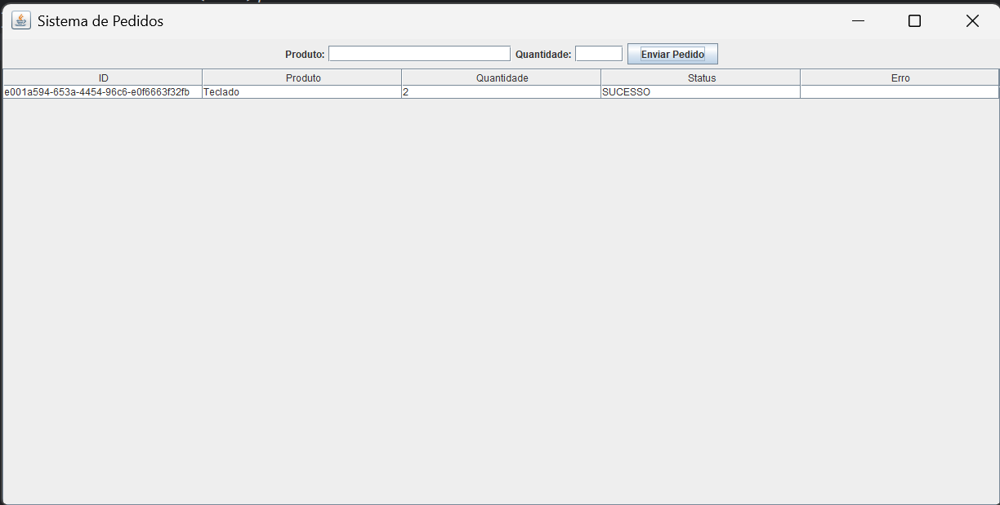

# Swing Pedidos Client - Teste Prático Java

Cliente desktop desenvolvido em **Java 8** com **Swing** para envio de pedidos ao backend e acompanhamento assíncrono do status via polling.

## Tecnologias utilizadas
- Java 8
- Swing
- Maven
- Jackson

## Funcionalidades implementadas
- Interface gráfica com:
  - campo de produto
  - campo de quantidade
  - botão para envio
  - tabela de acompanhamento de pedidos
- Geração de `UUID` para cada pedido
- Envio de pedido para o backend via HTTP
- Exibição inicial do pedido enviado
- Polling assíncrono para atualização de status
- Atualização da interface sem bloqueio da EDT

## Estrutura principal
- `model` - modelos usados no cliente
- `http` - comunicação HTTP com o backend
- `ui` - interface gráfica Swing
- `SwingClientApplication` - classe principal

## Como executar

### 1. Clonar o projeto
```bash
git clone https://github.com/ProgRS/swing-pedidos-client.git
```

### 2. Entrar na pasta do projeto
```bash
cd swing-pedidos-client
```

### 3. Compilar o projeto
```bash
mvn clean compile
```

### 4. Executar pela IDE
Executar a classe:

```text
com.luis.swingclient.SwingClientApplication
```

## Requisito para funcionamento
O backend precisa estar ativo em:

```text
http://localhost:8080
```

## Fluxo esperado
1. Informar produto e quantidade
2. Clicar em **Enviar Pedido**
3. O pedido é enviado ao backend
4. A tabela exibe o status inicial
5. O cliente faz polling periódico para consultar o status
6. O status é atualizado para:
  - `PROCESSANDO`
  - `SUCESSO`
  - `FALHA`

## Evidência da interface

### Cliente Swing em execução


## Observações
- O cliente utiliza `SwingWorker` para evitar bloqueio da interface.
- O polling é realizado com `Timer`.
- A atualização da UI é feita na Event Dispatch Thread.
- O cliente depende do backend para refletir o status real do pedido.
- A interface foi validada localmente com envio de pedido e atualização automática de status.
